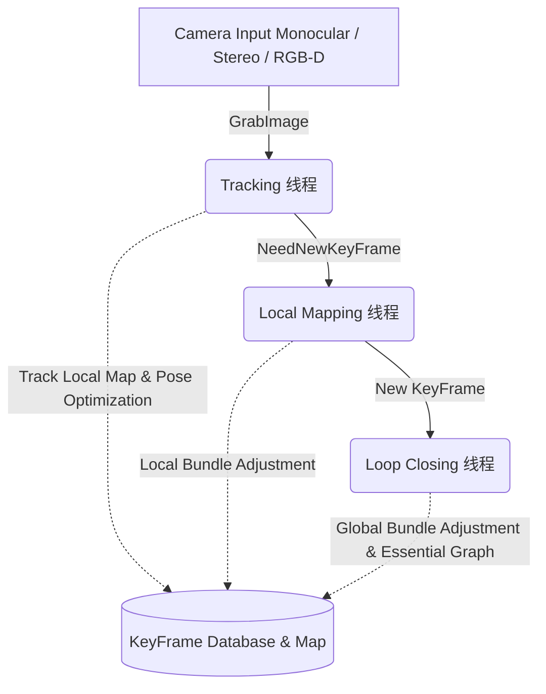

# ORB-SLAM2 核心原理解析与数学推导

本文档针对 ORB-SLAM2 的整体框架、多线程任务以及核心算法（如位姿估计的 PnP 问题、光束法平差 Bundle Adjustment、Sim3 回环修正等）进行了归纳与数学推导。

---

## 1. 系统总体框架 (Overall Framework)

ORB-SLAM2 采用了经典的**三大并行线程**架构，系统启动于 `System.cc`。

### 1.1 跟踪线程 (Tracking Thread)
**工作范围**：主线程中运行（前端）。
**核心流程**：
1. **ORB 特征提取**：保证在图像网格间均匀提取 FAST 角点，并计算方向与 BRIEF 描述子。
2. **初始位姿估计**：优先使用**恒速运动模型 (Motion Model)**。若失败或无历史速度则使用**参考关键帧 (Reference KeyFrame)** 进行特征匹配。严重丢失时启动**全局重定位 (Relocalization)**。
3. **局部地图跟踪 (Track Local Map)**：上述估计给出粗略位姿后，提取周围的关键帧和它们的地图点（局部地图）投射到当前帧视野内匹配，运用非线性优化(`PoseOptimization`)进一步细化相机位姿。
4. **状态判断**：判断是否产生了足够多的新关键信息，以决定并生成**新关键帧 (New KeyFrame)** 传递给后端。

### 1.2 局部建图线程 (Local Mapping Thread)
**工作范围**：后端的异步线程。
**核心流程**：
1. **处理新关键帧 (Process New KeyFrame)**：计算 BoW，加入 Covisibility Graph（共视关键帧图）。
2. **地图点剔除 (MapPoint Culling)**：严格筛除非正常匹配、或者极少被观测到的伪地图点。
3. **三角化生成新地图点 (Triangulation)**：在拥有足够大视差 (Parallax) 的共视关键帧间进行极线搜索并三角测量，得到新的 3D 点。
4. **局部 BA (Local Bundle Adjustment)**：优化当前局部窗口中的各个关键帧位姿和其观测到的局部地图点。
5. **关键帧剔除 (KeyFrame Culling)**：剔除 $90\%$ 地图点都被其它 $3$ 个及以上关键帧观测到的冗余帧。

### 1.3 回环检测线程 (Loop Closing Thread)
**工作范围**：处理全局累积误差。
**核心流程**：
1. **检测闭环候选 (Detect Loop)**：利用 DBoW2 计算相似度评分，在长廊末端或者原点附近触发闭环识别。
2. **计算 Sim3 变换 (Compute Sim3)**：单目相机长距离移动后会产生尺度畸变（Scale Drift）。这步通过 RANSAC 和 3D-3D/3D-2D 对应关系，求解出包含尺度因子的相似变换 (Similarity Transform)。
3. **闭环融合与优化 (Correct Loop)**：利用求解好的 Sim3 纠正当前位姿并将误差分摊至共视相连节点（Essential Graph Optimization），最后单独开启一个子线程做**全局BA (Global Bundle Adjustment)** 收敛全部轨迹。

---

## 2. 核心数学推导与优化矩阵

ORB-SLAM2 中大量的优化问题依赖于 `g2o` 库中的高斯牛顿法（Gauss-Newton）或列文伯格-马夸尔特法（Levenberg-Marquardt）。底层的核心是最小化**重投影误差 (Reprojection Error)**。

### 2.1 重投影误差基础 (Reprojection Error)
考虑一个空间中的 三维地图点 $\mathbf{P}_w = [X_w, Y_w, Z_w]^T$，它在当前帧被相机观测到，其在像素平面上的二维坐标观测值为 $\mathbf{u}_{obs} = [u, v]^T$。
相机的位姿为 $\mathbf{T}_{cw} = [\mathbf{R} | \mathbf{t}] \in SE(3)$，对应的李代数为 $\xi$。

将世界坐标点变换到相机坐标系下：
$$ \mathbf{P}_c = \mathbf{R} \mathbf{P}_w + \mathbf{t} = [X_c, Y_c, Z_c]^T $$

由于单目针孔相机模型具有内部参数 $K$ (焦距 $f_x, f_y$ 和光心 $c_x, c_y$)：
$$
\begin{cases}
u' = f_x \dfrac{X_c}{Z_c} + c_x \\
v' = f_y \dfrac{Y_c}{Z_c} + c_y
\end{cases}
$$

定义重投影误差 $\mathbf{e}$ 为观测坐标减去投影坐标：
$$ \mathbf{e}(\xi, \mathbf{P}_w) = \left[ \begin{matrix} u \\ v \end{matrix} \right] - \left[ \begin{matrix} f_x \dfrac{X_c}{Z_c} + c_x \\ f_y \dfrac{Y_c}{Z_c} + c_y \end{matrix} \right] $$

光束法平差 (Bundle Adjustment) 的无约束非线性最小二次目标函数表达式为：
$$ \xi^*, \mathbf{P}_w^* = \arg \min_{\xi, \mathbf{P}_w} \dfrac{1}{2} \sum_{i \in \text{KeyFrames}} \sum_{j \in \text{MapPoints}} \mathbf{e}_{ij}^T \Sigma_{ij}^{-1} \mathbf{e}_{ij} $$
*(其中 $\Sigma_{ij}$ 为特征提取金字塔层数所决定的协方差矩阵 信息矩阵 )*

### 2.2 Optimizer::PoseOptimization 的雅可比推导 (PnP 解法)
在 Tracking 线程中，$\mathbf{P}_w$ 从全局地图中查找到，被认为是**已知且固定不变**的常量，仅优化变量 $\xi$。此时我们需要推导重投影误差对李代数 $\xi$ 的雅可比矩阵 $\mathbf{J}_{\xi} = \dfrac{\partial \mathbf{e}}{\partial \xi}$。

利用链式法则：
$$ \mathbf{J}_{\xi} = \dfrac{\partial \mathbf{e}}{\partial \mathbf{P}_c} \dfrac{\partial \mathbf{P}_c}{\partial \xi} $$

第 1 部分，误差项对相机坐标系点积分（由相机内参得出）：
$$ 
\dfrac{\partial \mathbf{e}}{\partial \mathbf{P}_c} = -\left[ 
\begin{matrix} 
\dfrac{f_x}{Z_c} & 0 & -\dfrac{f_x X_c}{Z_c^2} \\
0 & \dfrac{f_y}{Z_c} & -\dfrac{f_y Y_c}{Z_c^2} 
\end{matrix}
\right] 
$$

第 2 部分，空间点对李代数 $\xi$ 的偏导数。
传统求导在 $SE(3)$ 上比较困难，通常我们采用**李代数左扰动模型 (Left Perturbation Model)**。
假设对于位姿施加一个微小的扰动 $\delta \xi = [\delta \rho, \delta \phi]^T$（其中 $\delta \rho$ 为平移扰动，$\delta \phi$ 为旋转旋转扰动），对原有的 3D 点 $\mathbf{P}_c$ 应用该微小扰动变换：
$$ \mathbf{P}_c' \approx (\mathbf{I} + \delta \phi^\wedge) \mathbf{P}_c + \delta \rho = \mathbf{P}_c + \delta \phi^\wedge \mathbf{P}_c + \delta \rho $$
因此，三维点的变化量可以展开为：
$$ \Delta \mathbf{P}_c = \delta \phi^\wedge \mathbf{P}_c + \delta \rho = -\mathbf{P}_c^\wedge \delta \phi + \delta \rho $$

我们可以很容易地把导数拆分为**平移**和**旋转**两部分进行观察：
1. **对平移扰动 $\delta \rho$ 的偏导数**（显而易见是一个单位阵）：
$$ \dfrac{\partial \mathbf{P}_c}{\partial \delta \rho} = \mathbf{I}_{3\times3} = \left[ \begin{matrix} 1 & 0 & 0 \\ 0 & 1 & 0 \\ 0 & 0 & 1 \end{matrix} \right] $$

2. **对旋转扰动 $\delta \phi$ 的偏导数**（利用反对称矩阵性质）：
$$ \dfrac{\partial \mathbf{P}_c}{\partial \delta \phi} = -[\mathbf{P}_c]_{\times} = \left[ \begin{matrix} 0 & Z_c & -Y_c \\ -Z_c & 0 & X_c \\ Y_c & -X_c & 0 \end{matrix} \right] $$

将平移和旋转两部分组合，即可得到空间点对 $SE(3)$ 李代数扰动 $\delta \xi$ 的雅可比矩阵：
$$ \dfrac{\partial \mathbf{P}_c}{\partial \delta \xi} = [\mathbf{I}_{3\times3} | -[\mathbf{P}_c]_{\times}] = 
\left[
\begin{matrix}
1 & 0 & 0 & 0 & Z_c & -Y_c \\
0 & 1 & 0 & -Z_c & 0 & X_c \\
0 & 0 & 1 & Y_c & -X_c & 0 
\end{matrix}
\right] 
$$

将上述两部分相乘（$2\times3$ 与 $3\times6$ 矩阵），即可得到维度为 $2 \times 6$ 的 $\mathbf{J}_{\xi}$ 解析解：
$$
\mathbf{J}_{\xi} = - \left[
\begin{matrix}
\dfrac{f_x}{Z_c} & 0 & -\dfrac{f_x X_c}{Z_c^2} & -\dfrac{f_x X_c Y_c}{Z_c^2} & f_x + \dfrac{f_x X_c^2}{Z_c^2} & -\dfrac{f_x Y_c}{Z_c} \\
0 & \dfrac{f_y}{Z_c} & -\dfrac{f_y Y_c}{Z_c^2} & -f_y - \dfrac{f_y Y_c^2}{Z_c^2} & \dfrac{f_y X_c Y_c}{Z_c^2} & \dfrac{f_y X_c}{Z_c}
\end{matrix}
\right]
$$
*(在 ORB-SLAM2 代码中，这就是 `EdgeSE3ProjectXYZOnlyPose::linearizeOplus()` 中所精确编写的内容。)*

### 2.3 Optimizer::LocalBundleAdjustment 的局部 BA 推导
在 Local BA 中，重投影误差不变，但**位姿 $\xi$ 和地图点 $\mathbf{P}_w$ 同时被设为优化变量**。
所以我们补充对地图点 $\mathbf{P}_w$ 的导数 $\mathbf{J}_\mathbf{P} = \dfrac{\partial \mathbf{e}}{\partial \mathbf{P}_w}$。

根据链式法则：
$$ \mathbf{J}_{\mathbf{P}} = \dfrac{\partial \mathbf{e}}{\partial \mathbf{P}_c} \dfrac{\partial \mathbf{P}_c}{\partial \mathbf{P}_w} $$

由于 $\mathbf{P}_c = \mathbf{R} \mathbf{P}_w + \mathbf{t}$，所以很容易得知：
$$ \dfrac{\partial \mathbf{P}_c}{\partial \mathbf{P}_w} = \mathbf{R} $$

因此，$2 \times 3$ 的雅可比为：
$$ \mathbf{J}_{\mathbf{P}} = \dfrac{\partial \mathbf{e}}{\partial \mathbf{P}_c} \mathbf{R} $$
利用 $\mathbf{J}_{\xi}$ 与 $\mathbf{J}_{\mathbf{P}}$ 构造黑塞矩阵的 $\mathbf{H}$ 矩阵块参数，求解 $\mathbf{H} \Delta x = \mathbf{b}$ 来更新关键帧和地图点。在 `g2o` 中由于边是 `EdgeSE3ProjectXYZ`，这部分计算被内建的图优化框架处理好了。

### 2.4 回环校正中的 Sim3 原理 (Sim3 Optimization)
考虑单目在经历一段较长的轨迹后闭合时，轨迹会有一点偏离原点，这是因为推算过程中产生了额外的缩放因子 $s$。
普通位姿属于群 $SE(3)$，而相似变换属于 $Sim(3)$：
$$ \mathbf{P}_{c} = s \mathbf{R} \mathbf{P}_{w} + \mathbf{t} $$

对于回环候选帧 $ref$ 与 当前帧 $cur$ ，通过 ORB 互相匹配出了 3D 特征点对。设他们分别对应的两组点云为 $\mathbf{P}_{ref,i}$ 和 $\mathbf{P}_{cur,i}$，那么可以通过求解 Horn 方法的绝对定向 (Absolute Orientation) 最小化：
$$ \min_{s, \mathbf{R}, \mathbf{t}} \sum_i \left\| \mathbf{P}_{ref,i} - (s \mathbf{R} \mathbf{P}_{cur,i} + \mathbf{t}) \right\|^2 $$

此非线性问题也可以在 `LoopClosing::ComputeSim3` 中由 `g2o` 和 RANSAC 辅助找出内点。求出 Sim3 $(\mathbf{S}_{cw})$ 后，算法会将其传播到周围的共视关键帧（即 `LoopClosing::CorrectLoop` 中的传播和 `OptimizeEssentialGraph`），有效拉平因追踪误差导致的累计重叠偏差现象。
